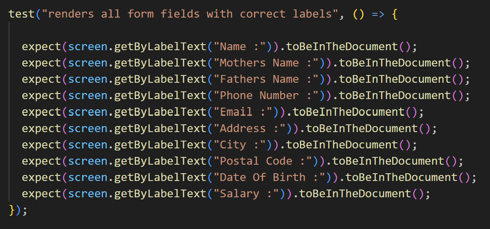
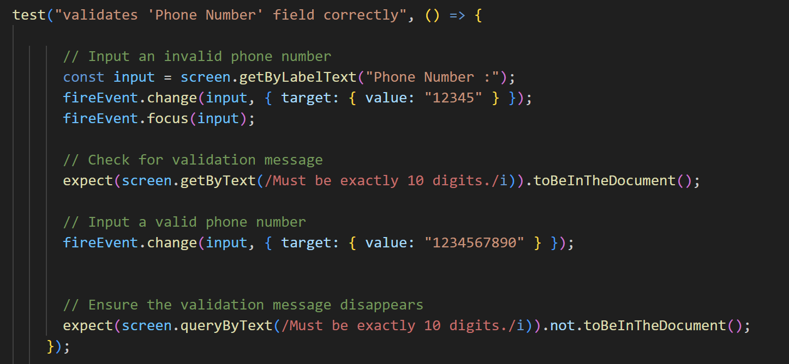
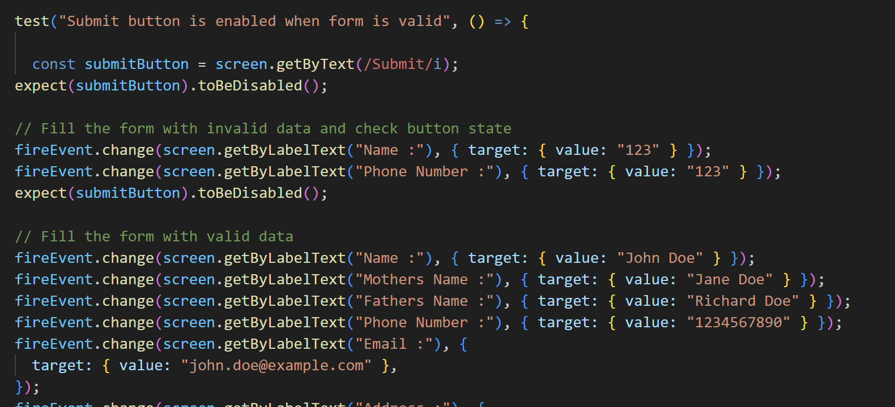
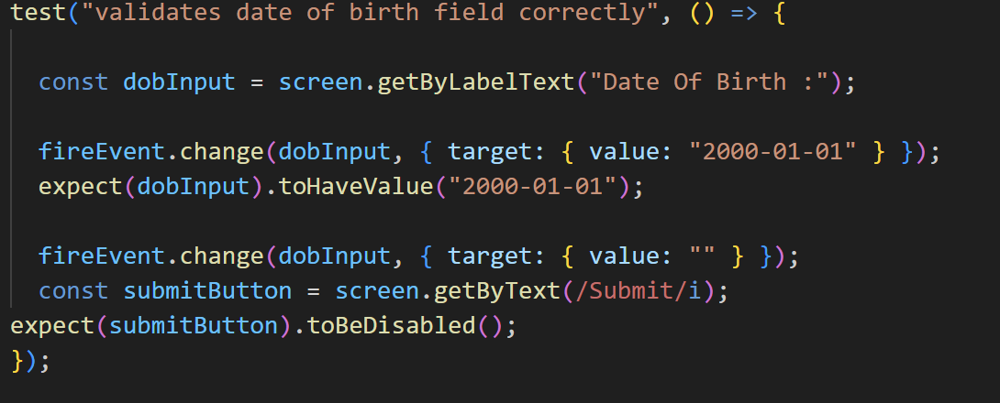
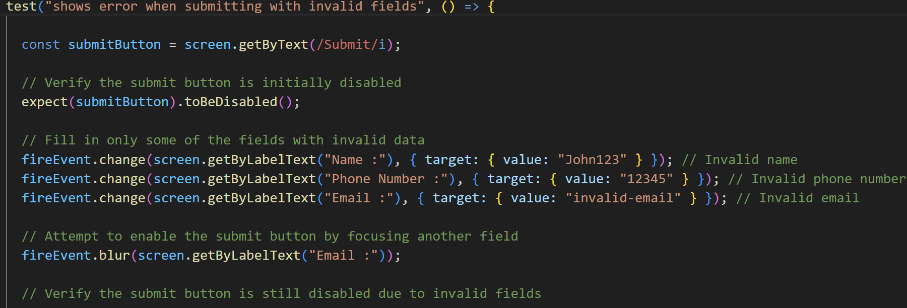
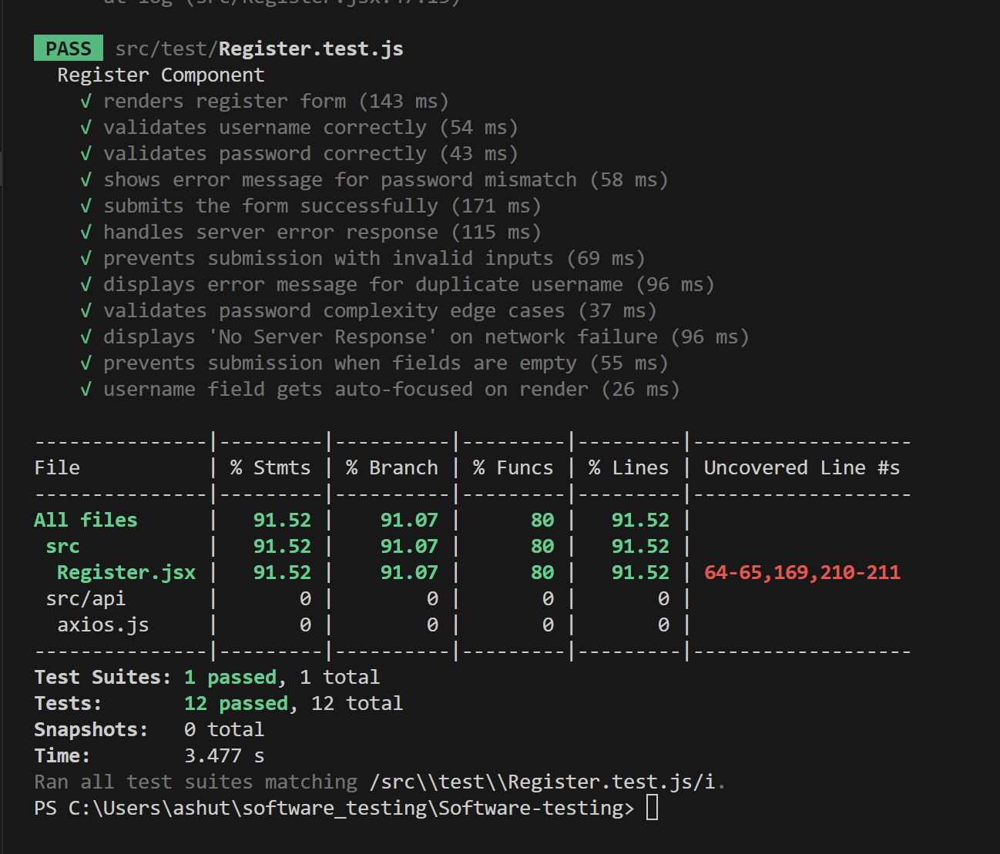
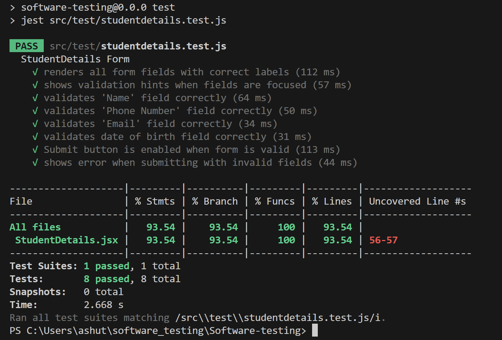
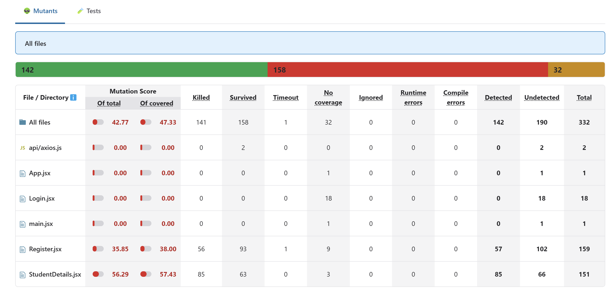

# Client-Side Web Applications Testing (Bypass Testing)

This project involves testing the client-side code of a web application by designing test cases to bypass client-side validation and sending changed/corrupt input to the server.

---

## 1. Code Repository  
Link to the complete code repository:  
https://github.com/seeker812/Software-testing/tree/main  

---

## 2. Team Contributions  
### Team Member 1: Sumit singh ; Roll No. : MT2023166  
- [Detailed contribution, e.g., designed test cases, wrote scripts, conducted testing, etc.]  

### Team Member 2: Ashutosh Dubey ; Roll No. : MT2023097  
- [Detailed contribution, e.g., implemented tools, analyzed results, documented findings, etc.]  

---

## 3. Test Case Strategy  

### Testing Focus  
The test cases aim to bypass the client-side validations implemented in the `StudentDetails and Register` component of a React application. These validations include regex-based input restrictions for fields such as name, email, phone number, postal code, and salary, among others.

### Strategy Details  

#### 1. Form Validation Bypass  
- **Approach:** Modify the validation rules in the client-side code using a mutation tool to simulate weak or missing validations.  
- **Objective:** Observe if the backend can detect and reject invalid inputs.

#### 2. Malicious Input Injection  
- **Approach:** Inject invalid inputs directly into the fields using browser developer tools or automated scripts to bypass the front-end validation logic.  
- **Objective:** Test how the system handles potentially malicious inputs bypassing client-side checks.

#### 3. Boundary Value Testing  
- **Approach:** Test the limits of input fields by entering edge-case values, such as:  
  - Empty inputs.  
  - Excessively long strings.  
  - Numbers outside the valid range.  
- **Objective:** Identify vulnerabilities in input handling at the boundaries of valid input.

#### 4. Mutation Testing of Validation Rules  
- **Approach:** Introduce deliberate errors into the regex patterns in the `validationRules` object.  
- **Objective:** Monitor the form's behavior and assess if the server can identify the mutated input as invalid.

---

## 4. Designed Test Cases and Execution  

### Test Case 1: Validate Form Field Rendering  
- **Objective:** Verify that all form fields are rendered with correct labels.  
- **Execution:**  
  1. Render the `StudentDetails` component using a testing library.  
  2. Assert the presence of fields like "Name", "Phone Number", "Email", and others using `screen.getByLabelText()`.  
- **Result:** All fields are correctly rendered with their labels.  
  
---

### Test Case 2: Validate Field-Level Input Constraints  
- **Objective:** Ensure individual fields provide validation feedback.  
- **Execution:**  
  1. Enter invalid inputs for specific fields, such as non-alphabet characters in "Name" or fewer than 10 digits in "Phone Number".  
  2. Use `fireEvent` to simulate user interactions like focus and change.  
  3. Verify validation error messages using assertions like `screen.getByText()`.  
- **Result:** Error messages are displayed for invalid inputs and disappear when corrected.  

---

### Test Case 3: Validate Form Submission Behavior  
- **Objective:** Verify form submission behavior under different conditions.  
- **Execution:**  
  1. Populate the form with invalid inputs and assert that the "Submit" button remains disabled.  
  2. Populate the form with valid inputs and verify that the "Submit" button is enabled and the success alert is displayed.  
- **Result:** The form prevents submission with invalid data and submits successfully with valid data.  

---

### Test Case 4: Validate Empty and Boundary Input Cases  
- **Objective:** Test fields with empty or boundary inputs.  
- **Execution:**  
  1. Leave mandatory fields like "Date of Birth" empty and ensure the "Submit" button is disabled.  
  2. Test fields like "Postal Code" with fewer than 5 digits or more than 6 digits and check for validation errors.  
- **Result:** The form handles empty and boundary cases as expected.  
 
---

### Test Case 5: Bypass Validation and Mutation Testing  
- **Objective:** Assess the impact of bypassing client-side validation.  
- **Execution:**  
  1. Use browser developer tools or mutation tools to alter validation rules in the `validationRules` object.  
  2. Inject invalid inputs into the form fields and submit.  
  3. Monitor server behavior for acceptance or rejection of invalid data.  
- **Result:** The server rejects bypassed invalid inputs.  

---
## 5. Tools Used  

### Jest  
- **Purpose:** Jest was used for unit testing the React component, form validation, and form submission behavior.  
- **Usage:** Jest allows simulating user interactions such as typing in form fields and submitting the form, enabling the verification of both client-side validation logic and server interaction for valid/invalid inputs.  
- **Key Features:**  
  - Mock functions to simulate user actions.  
  - Assertion methods to verify if the component behaves correctly after input changes or form submission.

### React Testing Library  
- **Purpose:** React Testing Library was used for rendering the React components and interacting with the form elements in a simulated browser environment.  
- **Usage:** This library helps simulate real-world user behavior by querying DOM elements (such as input fields and buttons) and firing events (such as `change` and `click`) to ensure the form's behavior is as expected.  
- **Key Features:**  
  - Rendering React components into a test DOM.  
  - Queries for elements like `getByLabelText`, `getByText` to interact with and assert element presence in the rendered component.

### Stryker(Mutation Tool) 
- **Purpose:** Stryker was used to alter client-side validation scripts in the React application to simulate weak or bypassed validations.  
- **Usage:** The mutation tool was utilized to modify the `validationRules` object in the client-side code, introducing intentional errors into the validation regex patterns. This allowed testing of how the form behaves when the validation rules are bypassed and how the server reacts to invalid input.
 --- 
 ## 6. Testing Results
 **Result of "Register test cases" **
 
  **Result of "studentDetails test cases" **
   
    **Result of "stryker" **
     
  

